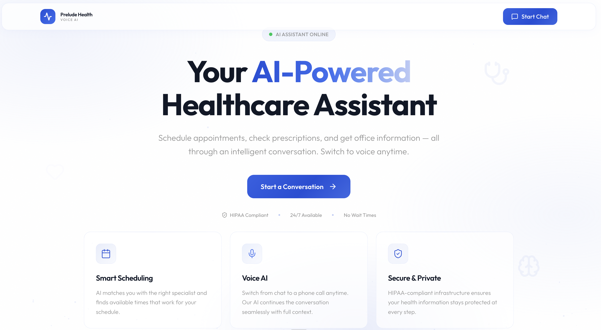
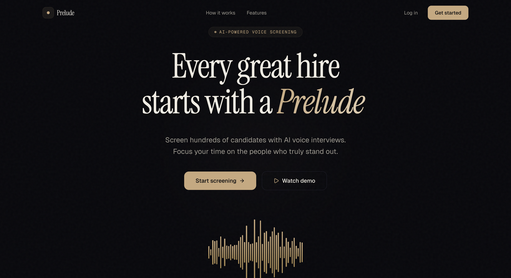

<!-- ==================== HEADER ==================== -->

<h1 align="center">Hi 👋, I'm Natasha Sebastian</h1>
<h3 align="center">AI/ML Engineer • Agentic Systems • Multimodal AI</h3>

  

---

<!-- ==================== SOCIALS ==================== -->

  
  
  

---

<!-- ==================== ABOUT ==================== -->

## 🚀 About Me  

- 🧠 Building **LLM agents, RAG systems, and multimodal AI pipelines**  
- 🏥 Shipped production AI in **healthcare, CV, and automation**  
- ⚡ Focused on **end-to-end AI systems (infra + models + UX)**  
- 🎓 MS Computer Science @ NYU  

---

<!-- ==================== TECH STACK ==================== -->

## 🧰 Toolbox  

### 🤖 AI / ML

### ⚙️ Systems

### ☁️ Data & Infra

---

## 🚀 Featured Projects

<table>
  <tr>
    <td align="center" width="33%">
      
        
      <strong>🎙️ Medical Scheduling & Voice Agent</strong>
       
      AI agent for patient routing, booking, and voice-based workflows.
    </td>
    <td align="center" width="33%">
      
        
      <strong>🤖 AI Pre-Screening Platform</strong>
       
      Real-time AI interviewer that automates recruiter phone screens.
    </td>
  </tr>
</table>
